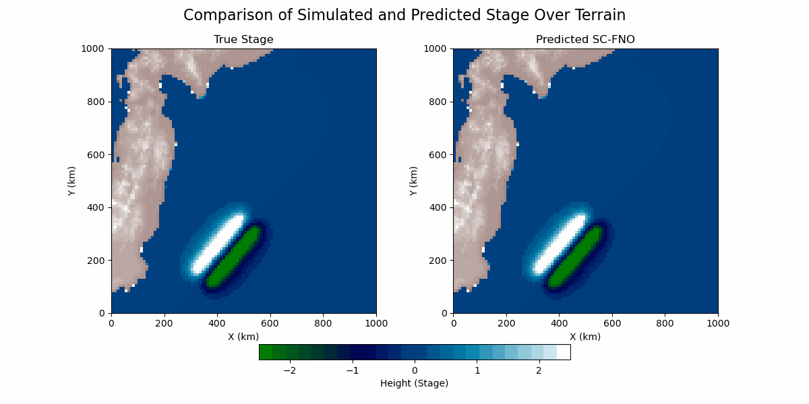
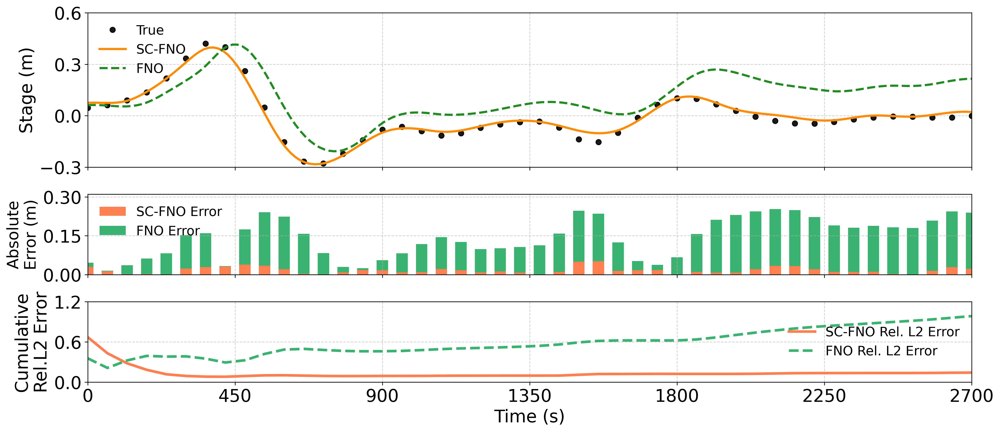

# Sensitivity-Driven Scaling Enables Real-Time Inference for High-Dimensional PDEs

Official implementation for the paper:

**Sensitivity-Driven Scaling Enables Real-Time Inference for High-Dimensional PDEs**  
*Currently under review*

---

## Overview

Modern AI models for physical systems often require very large training datasets, especially as the dimension and complexity of the governing equations increase. This issue is commonly known as the **curse of dimensionality**.

This repository introduces the **Sensitivity-Constrained Neural Operator (SC-NO)** framework. Instead of training neural operators only to predict physical states, SC-NO also trains them to learn how those states change with respect to input parameters. As a result, each training sample carries richer physical information.

This enables:

- Accurate forward prediction with fewer training samples
- Inverse parameter recovery from sparse observations
- Improved out-of-distribution robustness
- Better long-horizon stability
- Real-time inference for large-scale geophysical systems

One key demonstration is tsunami forecasting, where SC-FNO reconstructs seafloor deformation from sparse buoy measurements and forecasts tsunami propagation in under five minutes.

---
## Method Summary

The main idea behind SC-NO is simple: instead of learning only the final solution of a physical system, the model also learns how that solution changes when the input changes. This is important for high-dimensional PDEs because each simulation is expensive, and standard neural operators often need many samples to generalize well. By adding sensitivity information during training, each sample provides both the solution and its local response structure.

Mathematically, let the governing physical system define an operator:

<p align="center">
  
</p>

where `a` denotes the input parameters, initial condition, forcing, or source field, and `u` denotes the resulting physical state. A standard neural operator learns an approximation:

<p align="center">
  
</p>

In the proposed **Sensitivity-Constrained Neural Operator (SC-NO)** framework, the model is trained not only to match the solution field, but also to match the sensitivity of the solution with respect to the input:

<p align="center">
  
</p>

The training objective combines the standard prediction loss with a sensitivity-consistency loss:

<p align="center">
  
</p>

where

<p align="center">
  
</p>

and

<p align="center">
  
</p>

Here, `L_u` enforces accuracy in the predicted physical state, while `L_s` constrains the local input-output response of the learned operator. This makes each training sample more informative and improves generalization, especially when only limited simulation data are available.

In practice, this framework is implemented using sensitivity-constrained variants of Fourier Neural Operators, referred to as **SC-FNO** in the experiments.


---


## Visual Summary

<p align="center">
  
  <br>
  <em>Real-time tsunami propagation forecasting using SC-FNO.</em>
</p>

<p align="center">
  
  <br>
  <em>Comparison of stage prediction, absolute error, and cumulative relative L2 error between SC-FNO and FNO.</em>
</p>

---

## Repository Structure

```text
.
├── Tsunami/              # 2011 Tōhoku tsunami case study, source inversion, and SWE forecasting
├── NSE_sequential/       # Sequential Navier–Stokes/RANS experiments
├── NSE_rollout/          # Rollout-based Navier–Stokes/RANS experiments
├── Okada_surrogate/      # Surrogate components for the Okada deformation model
├── models/               # Neural operator architectures, including FNO and SC-FNO
├── lib/                  # Core solvers, utilities, data processing, and training routines
└── environment.yml       # Conda environment file
```

---

## Installation and Requirements

A Conda environment file is provided to easily install the required dependencies.


```bash
conda env create -f environment.yml
conda activate <environment_name>
```
*(Note: Please refer to the specific experiment directories for individual execution scripts and usage instructions once the environment is set up.)*

---
**Disclaimer**: This repository is associated with a paper currently under peer review. Data, code structure, and documentation may be subject to minor updates.